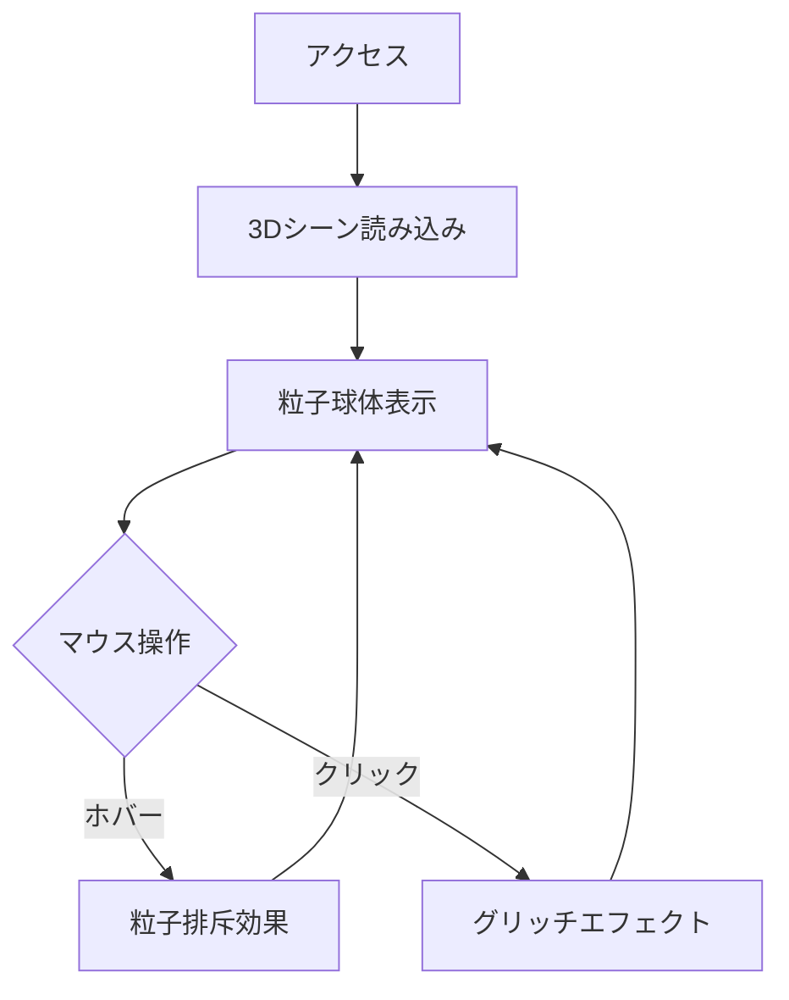

## 1. 製品概要
3D Glitch Particle Coreは、視覚的インパクト重視のインタラクティブアートWebアプリケーションです。10,000以上の粒子が形成する球体がマウス操作に反応し、クリックでグリッチエフェクトを発生させる斬新な体験を提供します。

- 解決する課題：従来の静的なWeb体験を超えた、没入型のビジュアルアート体験の提供
- 使用対象：ビジュアルアート愛好家、テクノロジー愛好者、デジタルアート鑑賞者
- 製品の価値：サイバーパンク美学と最新のWebGL技術を融合し、"クール"で記憶に残る体験を創出

## 2. コア機能

### 2.1 ユーザーロール
本製品は鑑賞者向けの単一ロールシステムとし、ユーザー登録は不要です。

| ロール | 登録方法 | コア権限 |
|------|---------|----------|
| 訪問者 | 不要 | 3Dシーンの鑑賞、マウスインタラクション、グリッチエフェクトのトリガー |

### 2.2 機能モジュール
3D Glitch Particle Coreは以下の主要ページで構成されます：

1. **メイン3Dシーンページ**：粒子球体表示、マウスインタラクション、グリッチエフェクト制御、UIオーバーレイ

### 2.3 ページ詳細
| ページ名 | モジュール名 | 機能説明 |
|-----------|-------------|----------|
| メイン3Dシーン | 3D粒子球体 | 10,000以上の粒子が形成する球体をレンダリングし、常時回転アニメーションを適用 |
| メイン3Dシーン | マウスインタラクション | マウスカーソルに反応して粒子を排斥し、乱流効果を生成する |
| メイン3Dシーン | グリッチエフェクト | クリック時にRGBシフトとノイズエフェクトを適用し、一時的な視覚的攪乱を発生 |
| メイン3Dシーン | コントロールUI | エフェクト強度調整、リセットボタン、FPS表示を提供 |

## 3. コアプロセス
訪問者はWebアプリにアクセスすると、自動的に3Dシーンがロードされます。マウスを移動させると粒子が反応し、クリックでグリッチエフェクトが発生します。

## 4. ユーザーインターフェースデザイン

### 4.1 デザインスタイル
- **プライマリカラー**：#00ff41（ネオングリーン）、#ff0080（ネオンピンク）、#0080ff（ネオンブルー）
- **セカンダリカラー**：#1a1a1a（ディープブラック）、#2a2a2a（ダークグレー）
- **ボタンスタイル**：フラットデザイン、角丸なし、ホバー時にネオングロー効果
- **フォント**：Orbitron（サイバーパンク系）、16px基本、24px見出し
- **レイアウト**：全画面3Dビュー、最小限のUIオーバーレイ
- **アイコンスタイル**：線画アイコン、ネオンカラー、シンプルで未来的

### 4.2 ページデザイン概要
| ページ名 | モジュール名 | UI要素 |
|-----------|-------------|----------|
| メイン3Dシーン | 3Dビューポート | 全画面表示、黒背景、中央に粒子球体、周囲にネオンガイドライト |
| メイン3Dシーン | コントロールパネル | 右上に配置、透明度70%、黒背景、ネオンボーダー、スライダーとボタン |
| メイン3Dシーン | ステータス表示 | 左下にFPSカウンター、ネオングリーン文字、最小限の情報のみ |

### 4.3 レスポンシブ対応
デスクトップファーストアプローチで設計し、モバイルデバイスではタッチインタラクションに最適化します。画面サイズに応じてUI要素の配置を調整します