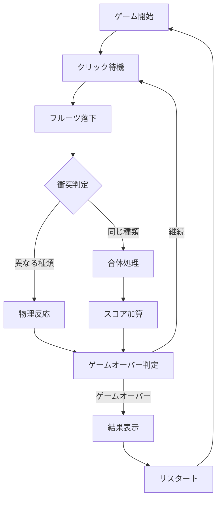

## 1. 製品概要
ブラウザで動作する物理演算・合体パズルゲーム（スイカゲーム風）。画面上部からクリックした位置にフルーツが落下し、同じ種類がぶつかると合体して大きなフルーツに進化する。物理エンジンによる重力、衝突、回転のリアルな動きを実装。

初心者開発者でも数行のコードで見栄えする実用的なゲームを作成できることを目指す。

## 2. コア機能

### 2.1 ユーザー役割
| 役割 | 登録方法 | コア権限 |
|------|----------|----------|
| ゲストユーザー | 不要 | ゲームプレイ、スコア記録 |

### 2.2 機能モジュール
物理演算・合体パズルゲームの要件は以下の主要ページで構成される：

1. **ゲーム画面**: プレイエリア、落下物、スコア表示、物理演算
2. **ゲームオーバー画面**: 最終スコア、リスタートボタン

### 2.3 ページ詳細
| ページ名 | モジュール名 | 機能説明 |
|----------|-------------|----------|
| ゲーム画面 | プレイエリア | クリックした位置にフルーツを落下させる。画面外枠から溢れたらゲームオーバー |
| ゲーム画面 | 物理演算エンジン | Matter.jsによる重力、衝突判定、回転、反発のシミュレーション |
| ゲーム画面 | 合体メカニズム | 同じ種類のフルーツが衝突すると、大きなフルーツに進化（例：🍇+🍇→🍉） |
| ゲーム画面 | スコアシステム | 合体回数に基づいてスコアを加算、リアルタイム表示 |
| ゲームオーバー画面 | 結果表示 | 最終スコア、最高記録との比較 |
| ゲームオーバー画面 | リスタート | ゲームを初期状態に戻して再開 |

## 3. コアプロセス

### ゲームプレイフロー
1. ゲーム開始 → 画面上部にプレイエリア表示
2. マウスクリック → クリック位置からフルーツを落下開始
3. 物理演算 → 重力で落下、他のフルーツと衝突
4. 合体判定 → 同じ種類のフルーツが接触すると大きなフルーツに変化
5. ゲームオーバー → フルーツが枠から溢れた時点で終了
6. スコア記録 → 合体回数に応じてスコアを表示

## 4. ユーザーインターフェース設計

### 4.1 デザインスタイル
- **プライマリカラー**: オレンジ（#FF6B35）- フルーツの温かみ
- **セカンダリカラー**: グリーン（#4ECDC4）- 自然な印象
- **ボタンスタイル**: 角丸（8px）、シャドウ効果、ホバー時に明るく
- **フォント**: Noto Sans JP、基本サイズ16px、見出し24px
- **レイアウト**: カードベース、中央配置のプレイエリア
- **アイコン**: 絵文字を活用（🍇🍊🍋🍉）

### 4.2 ページデザイン概要
| ページ名 | モジュール名 | UI要素 |
|----------|-------------|----------|
| ゲーム画面 | プレイエリア | 背景：薄いグレーのグリッド模様。外枠：2pxのダークグレー境界線。サイズ：800×600px |
| ゲーム画面 | スコア表示 | 右上に角丸カード、白背景、オレンジの文字で「スコア: 0」を表示 |
| ゲーム画面 | 落下予測線 | マウスカーソル位置から下方向に破線を表示、落下位置を視覚的に示す |
| ゲームオーバー画面 | 結果モーダル | 半透明の黒オーバーレイ、中央に白い角丸カード、大きな「GAME OVER」文字 |

### 4.3 レスポンシブ対応
- デスクトップファースト設計
- 画面サイズに応じてプレイエリアをスケーリング（最小400×300px）
- タッチデバイスではクリック代わりにタップ操作をサポート

### 4.4 物理演算ガイド
- **重力設定**: 自然な落下速度（y: 1.0）
- **衝突反発**: 0.3-0.5（フルーツ同士の柔らかい印象）
- **摩擦係数**: 0.1（滑らかな動き）
- **回転**: 衝突時にランダムな角速度を追加
- **境界設定**: 画面下部と左右に接地判定、上部は開放